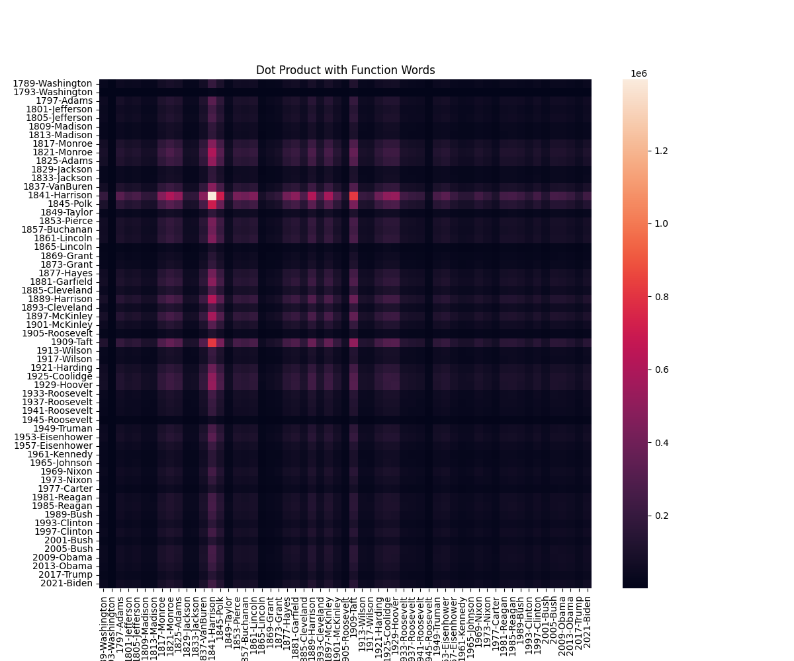
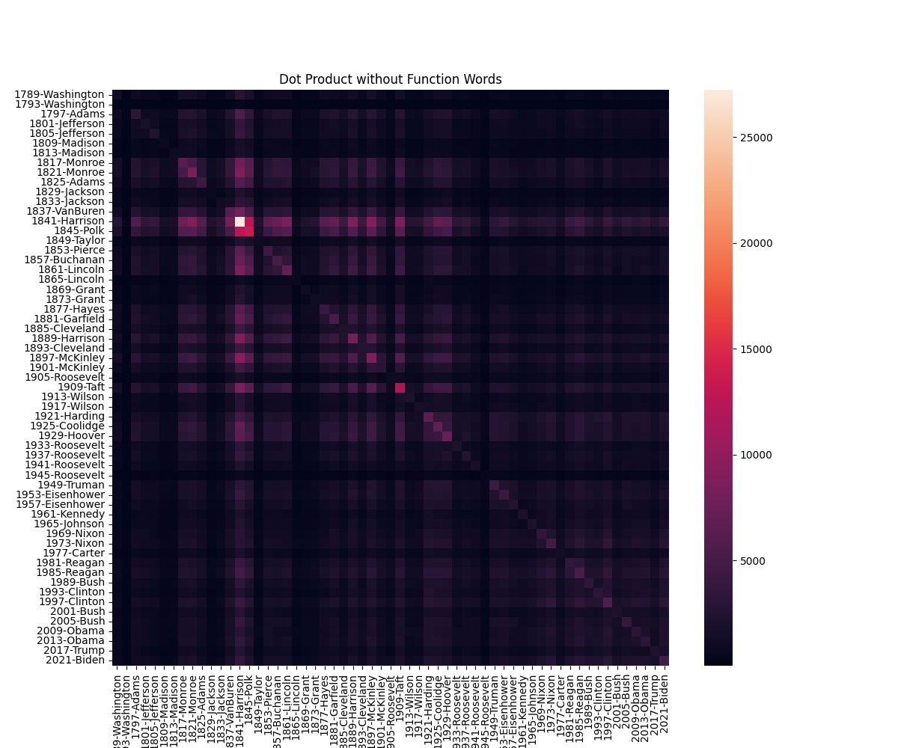
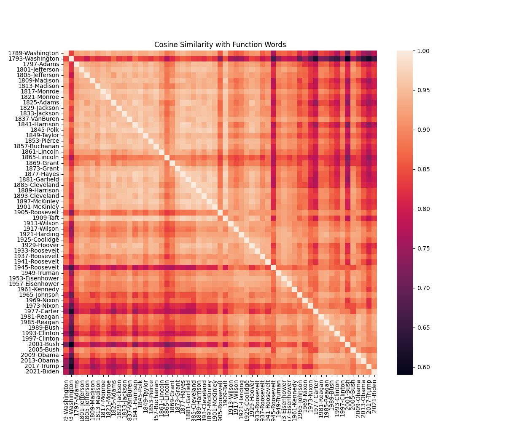
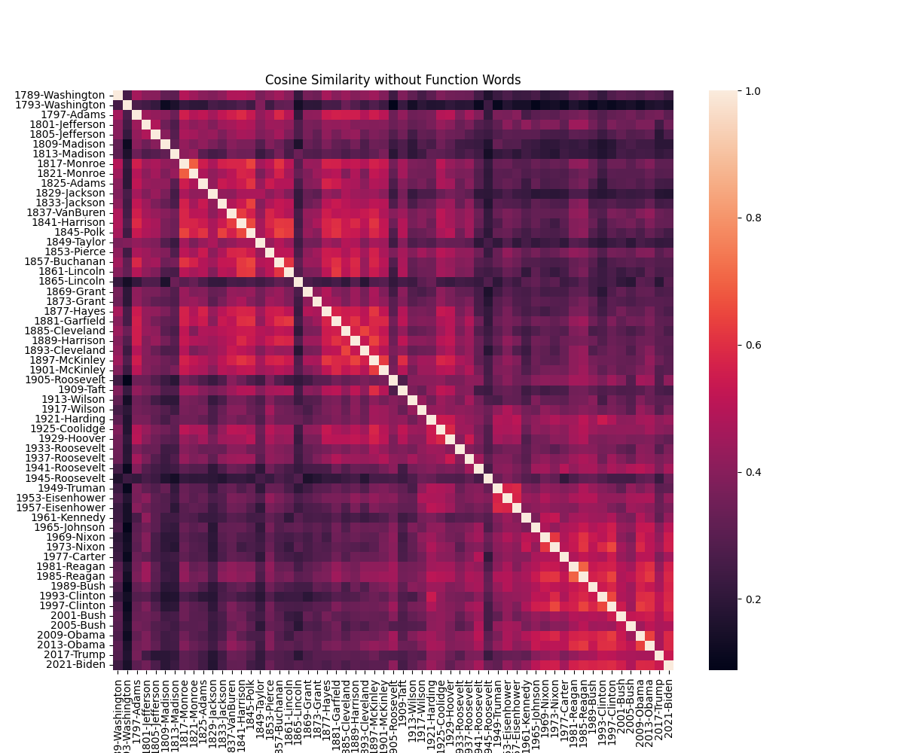

# Text Exploration and Data Analysis: Task 1

This task is part of a course on text exploration (data mining) and data analysis at the Warsaw Institute of Technology. 

# Task 

Using the corpus of inaugural speeches, calculate the dot product and cosine similarity for texts with and without function words, and present the results in the form of heatmaps (i.e., there will be 4 heatmaps).

# Results

